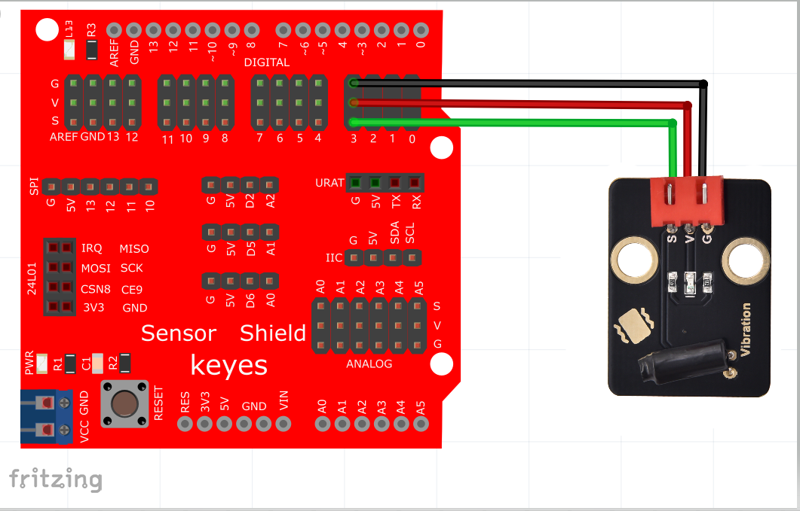

# Arduino


## 1. Arduino简介  

Arduino是一种开源电子原型平台，旨在帮助用户学习电子与编程的基本概念。Arduino开发板（如UNO）支持多种传感器和模块，使用户能够通过简单的编程（基于C/C++语言）构建互动项目。Arduino被广泛应用于教育、创客活动及个人工作室，提供丰富的社区资源与教程，适合各类技术水平的学习者。它的可编程性和灵活性使得它在智能家居、机器人、艺术装置等领域具有广泛应用。  

## 2. 接线图  

  

## 3. 测试代码（测试软件版本：arduino-1.8.12）  

```arduino  
int Led=13; //定义LED 接口  
int Shock=3; //定义震动传感器接口  
int val; //定义数字变量val  

void setup() {  
    pinMode(Led,OUTPUT); //定义LED 为输出接口  
    pinMode(Shock,INPUT); //定义震动传感器为输入接口  
}  

void loop() {  
    val = digitalRead(Shock); //将数字接口3的值读取赋给val  
    if(val == LOW) { //当val为低电平  
        digitalWrite(Led, HIGH); //LED亮起  
        delay(1000); //延时1S  
    } else {  
        digitalWrite(Led, LOW); //LED变暗  
    }  
}  
```  

## 4. 测试结果  

按照上图接好线，烧录好代码后，上电后，摇晃震动传感器，就可以观察到传感器上D1和Arduino UNO 板上的D13的指示灯会闪烁。


