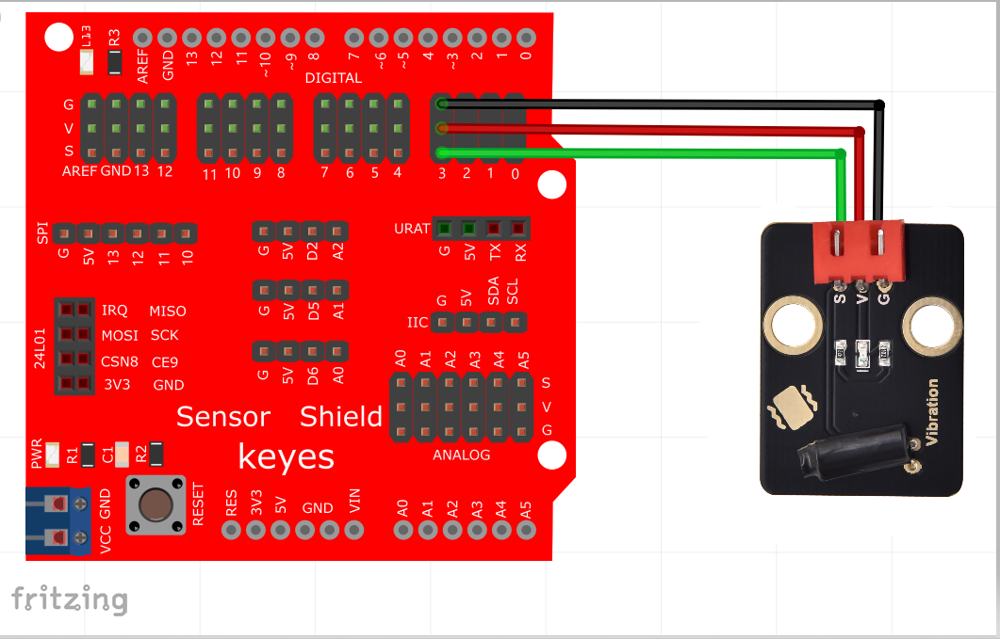

# KidsBlock

## 1. KidsBlock简介  

KidsBlock是一款图形化编程平台，专为儿童和初学者设计，致力于让编程和电子学习变得简单易懂。它基于Scratch理念，允许用户通过拖拽模块来创建程序，实现与硬件的实时互动。KidsBlock支持Arduino编程，使得用户能够通过直观的界面和丰富的模块快速上手，构建各种电子项目。该平台包含多种示例和教程，非常适合教育机构和创客活动，促进学生的创造力和实践能力。  

## 2. 接线图  

  

## 3. 测试代码（软件测试版本：Kidsblock 1.0.0）  

  

## 4. 测试结果  

按照上图接好线，烧录好代码后，上电后，摇晃震动传感器，就可以观察到传感器上D1和Arduino UNO板上的D13的指示灯会闪烁。

