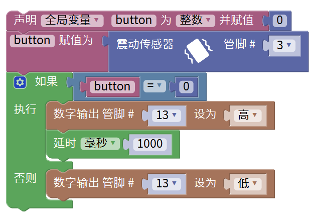

# Mixly

## 1. Mixly简介  

Mixly是一款图形化编程平台，专为儿童和初学者设计，致力于让编程和电子学习变得简单易懂。该平台提供了友好的拖拽式界面，用户可以通过简单的模块拼接来创建程序并与Arduino等平台互动。Mixly支持多种编程语言，尤其适合教育用途，并提供丰富的示例和项目，鼓励学生的创造力和实践能力。通过使用Mixly，用户能够快速上手并实现各种有趣的电子项目。  

## 2. 接线图  

  

## 3. 测试代码（软件测试版本：Mixly 1.2.0）  

  

**注意：** 程序编译之前先导入库Keyes sensor。  

## 4. 测试结果  

按照上图接好线，烧录好代码后，上电后，摇晃震动传感器，就可以观察到传感器上D1和Arduino UNO板上的D13的指示灯会闪烁。

