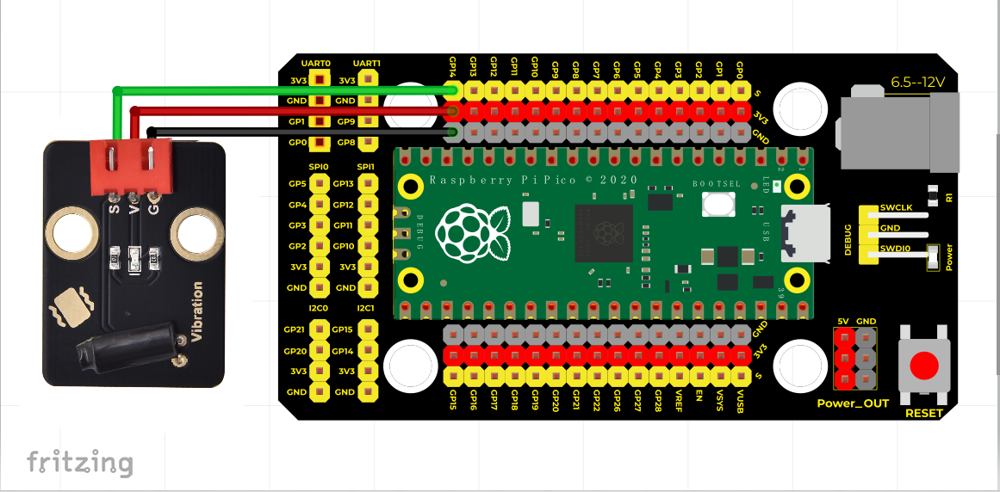

# Python


## 1. Python简介  

Python是一种广泛使用的高层次编程语言，因其简洁的语法和强大的可扩展性而受到欢迎。作为一种通用编程语言，Python适用于许多应用，包括数据分析、机器学习、网络开发、自动化以及天文学等多个领域。Python拥有丰富的库和框架，能够提高开发效率，助力用户快速实现自己的项目。它具有良好的可读性和社区支持，非常适合初学者和专业开发者使用。  

## 2. 接线图  

  

## 3. 测试代码（软件测试：Thonny）  

```python  
import machine  
import utime  

led_external = machine.Pin(25, machine.Pin.OUT)  # 设置GPIO25为输出  
button = machine.Pin(14, machine.Pin.IN, machine.Pin.PULL_UP)  # 设置GPIO14为震动输入  

while True:  
    if button.value() == 0:  # 检测是否震动  
        led_external.value(1)  # 点亮板载LED灯  
        utime.sleep(1)  # 延时1S  
        led_external.value(0)  # 熄灭板载LED灯  
```  

## 4. 测试结果  

按照上图接好线，烧录好代码后，上电后，摇晃震动传感器时板载LED点亮，震动传感器静止时板载LED熄灭。


